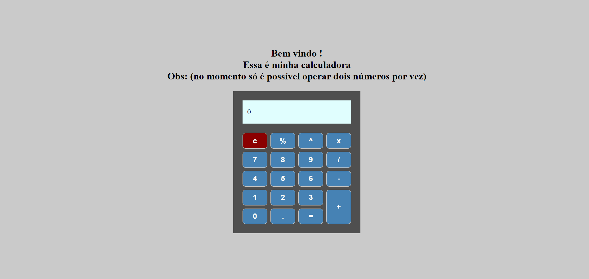

# Projeto da Calculadora React 

Este é um projeto de exemplo de uma calculadora desenvolvida em React. A calculadora permite realizar operações básicas de adição ➕, subtração ➖, multiplicação ✖️ e divisão ➗. Foi criada utilizando o `create-react-app` como base e estilizada com a biblioteca `styled-components`.

## Preview



## Configuração

1. **Clonando o repositório:**
   ```
   git clone https://github.com/Vinicius-b-oliveira/calculadora-react
   ```
2. **Instalando dependências:**
   ```
   npm install
   ```
   Este comando instalará todas as dependências necessárias para o projeto.

3. **Iniciando no navegador:**
   ```
   npm start
   ```
   Este comando criará um servidor local para o projeto.

## Como Usar

Você pode usar a calculadora simplesmente clicando nos botões numéricos e de operações para realizar os cálculos desejados. Os resultados serão exibidos no visor da calculadora. Vale ressaltar também que só é possível inserir dois números por vez. 🚀 